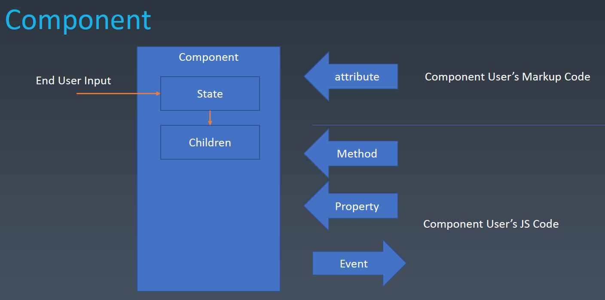
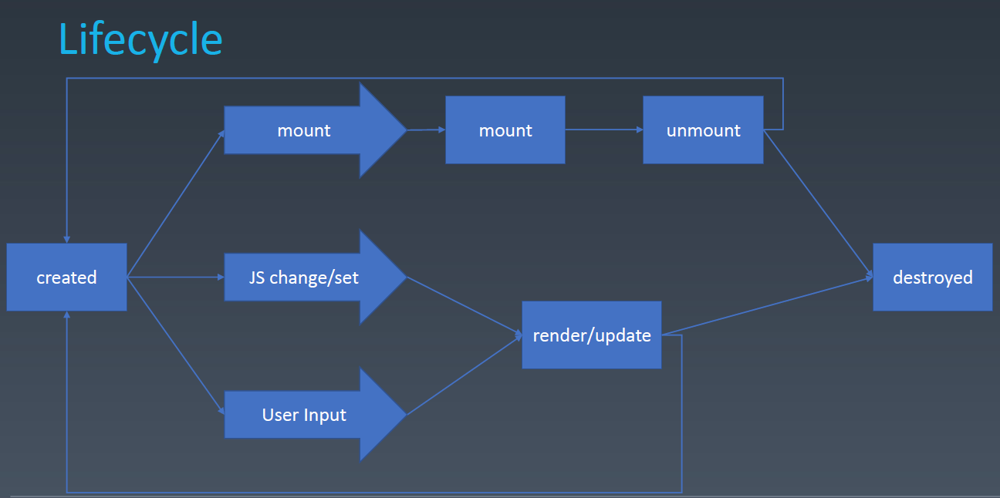

# 组件化

前端架构主要包含架构模式和组件化。

从编码角度来看，声明式方式更直观。组件化就是设计了一套方法，能让开发者用声明式方式（比如 HTML）写组件。

## 组件化实现方式

当前，组件化的实现方式主要有两种：

1. class 形式。本项目主要讲这种实现。
2. hooks 形式

## 组件组成

对象的组成包括：

- Properties
- Methods
- Inherit

组件一般用对象来抽象表示，而且额外增加了：

- Attributes
- Config
- State
- Event
- Lifecycle
- Children



上图是一个 Component 的组成图。

在代码中，组成部分可以表示为：

```javascript
class MyComponent extends Component { // Inherit
  // Config
  constructor(config) {
    // State
    this.state = {};
  }

  // Properties
  set props1() {}
  get props1() {}

  // Attributes
  setAttribute(key, value) {}
  getAttribute(key) {}

  // Children
  setChildren(){}
  getChildren(){}

  // Lifecycle
  mounted(){}
  render(){}

  // Methods
  go(){}

  // Event
  handleClick(){}
}

// Attributes
<MyComponent attr1="v">
  {/* Children*/}
  <div></div>
</MyComponent>;
```

### Attributes 和 Properties

Attributes 强调描述性，一般使用标记语言（HTML 等）、模板语言（JSX 等）表示。我们可以把它当作 property 的默认值。当然，就像 JavaScript 可以操纵 DOM 一样， Attribute 也可以使用 JavaScript 来操纵。伪代码为：

```javascript
// set attribute
<myComponent a="v" />;
myComponent.setAttribute("a", "value");

// get attribute
myComponent.getAttribute("a");
```

Properties 强调从属关系，是对象的一部分。一般使用 JavaScript 来操纵。页面上展示的实际上是 property 的内容。伪代码为：

```javascript
// set property
myComponent.a = "value";
```

Attributes 和 Properties 可以保持一致，也可以保持不一致，由具体 API 层面决定。比如，在 React 的 API 采用了保持一致的设计思路；但是，DOM API 采取了另一种方式。

```html
<input value="cute" />

<script>
  let input = document.getElementsByTagName("input")[0];
  input.value; // cute 访问 property
  input.getAttribute("value"); // cute 访问 attribute

  input.value = "hello"; // 更改 property。注意，这里并不会去更改 attribute
  input.value; // hello 访问 property
  input.getAttribute("value"); // cute 访问 attribute
</script>
```

### Methods

Method 是对象拥有的方法。用户可以调用方法来改变组件。

### Inherit

表示组件的继承关系。但是很多时候，我们会采用组合的方式，而不是采用继承方式。

### Config

表示组件的配置。比如一些组件全局设置、环境变量等。

### State

表示组件内部的状态，只能由用户输入来改变。

### Event

表示组件的事件。

### Lifecycle



上图是组件的生命周期。

### Children

Children 分为 Content 型和 Template 型。

```javascript
// Content 型
<my-button>>{{title}}</my-button>

// Template 型。下图中，使用data-xxx 生成多个 li
<my-list data-xxx>
    <li>{title}}</li>
</my-list>
```

## 如何设计组件状态

|           | Markup Set | JavaScript Set | JavaScript Change | User Input Change |
| --------- | ---------- | -------------- | ----------------- | ----------------- |
| property  | ×          | √              | √                 | ?                 |
| attribute | √          | √              | √                 | ?                 |
| state     | ×          | ×              | ×                 | √                 |
| config    | ×          | √              | ×                 | ×                 |

## 练手项目

- [使用 JSX 构建组件](./使用JSX构建组件.md)
- [使用 vanilla JavaScript 构建 Carousel 组件](./使用vanilla-JavaScript构建Carousel组件.md)
- 实现一个 animation 库
- 实现一个 gesture 库
- 使用 JSX 构建 Carousel 组件
- 使用 SFC 构建组件
