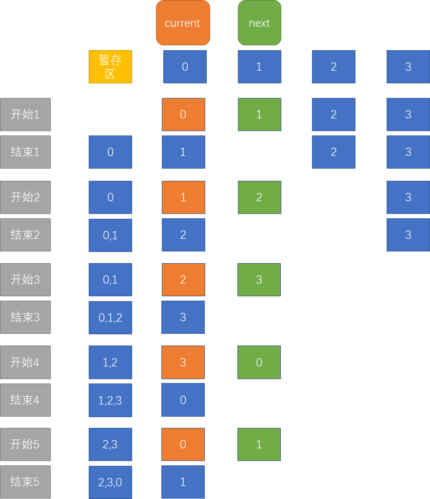

# 使用 vanilla-JavaScript 构建 Carousel 组件

我们使用 vanilla-JavaScript 构建一个 Carousel 组件，实现该组件的自动播放以及滑动。

## 搭架子

新建 `index.css`、`index.js` 以及 `index.html`，不引用任何第三方包，当作项目架子。

架子搭好的标准就是运行 `index.html`，能看到一张猫图，但是还没有其他任何功能。

## 增加自动循环播放 slide 功能

为了表达这个过程，我画了下面这个图：



从上图可知，slide 循环播放，我们需要定义两个关键帧：

1. 第一个关键帧是动画开始前，当前图片和下一张图片的位置需要移动到对的位置
2. 第二个关键帧是动画结束后，当前图片和下一张图片，都需要向左移动 -100%

那么问题已经很明确了，我们只需要找到动画开始前的关键帧：

1. 确定当前图片位置
2. 确定下一张图片位置

很容易的，我们就能得到：

```javascript
currentImg.style.transform = `translateX(${-100 * currentPosition}%)`;
nextImg.style.transform = `translateX(${100 - 100 * nextPosition}%)`;
```

找到每次的两个关键帧后，我们只需要让它们通过 `setTimeout` 循环触发就行了。

## 增加鼠标滑动功能

我们先来想想，我们拖动图片分为几步？

没错，分为：

1. 按下鼠标
2. 移动鼠标
3. 弹起鼠标

为了实现这个功能，我们需要设计一套监听流程：

1. 将每张图片都设置为 `dragable="false"`
2. 我们给外部的 div 设置一个监听 mousedown 监听事件
3. 每次 mousedown 事件发生后：
   1. 注册监听 mousemove 和 mouseup 事件
      1. 每次 mousemove 事件发生后，那就让它发生吧
      2. 每次 mouseup 事件发生后，移除对 mousemove 和 mouseup 事件的监听

伪代码为：

```javascript
this.rootDom.addEventListener("mousedown", () => {
  console.log("mousedown");

  const move = () => {
    console.log("mousemove");
  };

  const up = () => {
    console.log("mouseup");
    document.removeEventListener("mousemove", move);
    document.removeEventListener("mouseup", up);
  };

  document.addEventListener("mousemove", move);
  document.addEventListener("mouseup", up);
});
```

请注意，只有 mousedown 是注册在 rootDom 上的，其他都注册在 document 上。原因是因为，拖动鼠标有时候会拖到 rootDom 的外部。

接下来，我们要处理触发 mousedown 事件后的逻辑。刚开始点下去的时候，要让前一张图、现在的图以及下一站那个图就位。我们可以用下面这个图来解释：


上图中，黄底表示图片的原始位置。粗体字所在的地方，表示各个图片在各个 position 值情况下应该处于的位置，偏移量表示从原始位置到应该处于的位置需要平移的距离。好了，现在就相当于求线性方程了，输入是各个 position，输出是偏移量。

```javascript
prevImg.style.transform = `translateX(${-100 * (prevPosition + 1)}%)`;
currentImg.style.transform = `translateX(${-100 * currentPosition}%)`;
nextImg.style.transform = `translateX(${-100 * (nextPosition - 1)}%)`;
```

接下来，我们接着处理触发 mousemove 事件后的逻辑。这个逻辑也简单，只要在上一步的位置基础上，算出 move 的偏移量就可以。

最后，我们来看一下触发 mouseup 事件后的逻辑。在这里，我们需要动画效果。然后根据鼠标的偏移量，来决定是往前、保持、还是往后展示图片。

## 缺陷

该项目完成了上述的俩个功能，但是，俩个功能整合起来还有 bug。这个 bug 在这里不修复。会在 JSX 构建 Carousel 组件那里进行修复。
